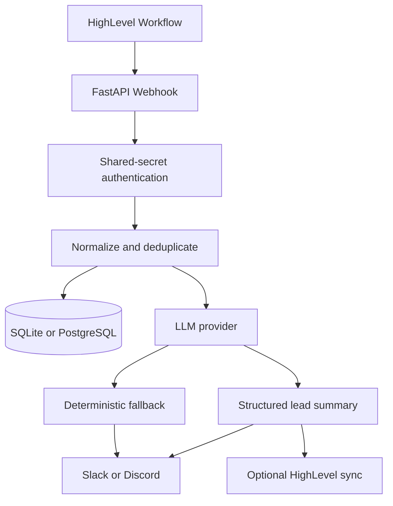

# HighLevel AI Lead Bridge

A production-minded FastAPI service that receives HighLevel lead events, validates and deduplicates them, generates structured AI summaries, sends actionable Slack or Discord alerts, and can optionally update the HighLevel contact.

## Business problem

BrightSmile Dental Clinic receives leads through Facebook Ads and HighLevel landing pages. Form submissions can be incomplete, staff may respond slowly, and incoming lead details are not always easy to act on.

## Solution

The service turns a HighLevel-style webhook into a validated, deduplicated, structured lead handoff. It works without paid credentials in demo mode and makes integration failures visible without losing the original event or summary.

## Architecture



## Key features

- `POST /webhooks/highlevel` webhook intake with constant-time shared-secret comparison
- Pydantic validation, whitespace normalization, stable payload hashing, and idempotency
- SQLite development storage, with `DATABASE_URL` ready for PostgreSQL
- Structured summaries with mock, OpenAI, Ollama, and OpenAI-compatible providers
- Bounded retries for temporary provider, notification, and HighLevel API failures
- Deterministic no-AI fallback so lead processing remains useful during LLM outages
- Per-attempt provider, model, token, latency, cost, success, and fallback metadata
- Slack and Discord incoming-webhook notifications
- Optional HighLevel contact note, tag, and recommended-action custom-field updates
- Docker configuration, environment-based settings, and automated tests with no external secrets

## Example notification

```text
New Qualified Lead

Name: Maria Santos
Service: Dental implants
Preferred schedule: Saturday morning
Source: Facebook Ads

Overview:
Maria is interested in dental implants and asked about installment options.

Urgency: High
Qualification: High Intent

Recommended action:
Call within 15 minutes and confirm available Saturday consultation slots.
```

## Technology stack

- Python 3.12+, FastAPI, Pydantic v2, SQLAlchemy async
- SQLite by default; PostgreSQL-ready via SQLAlchemy URL configuration
- HTTPX and Tenacity for outbound API clients and bounded retries
- Pytest, Ruff, and MyPy
- Docker and Docker Compose

## Quick start

Prerequisites: Python 3.12+.

```powershell
Copy-Item .env.example .env
.venv\Scripts\python.exe -m pip install -e .
.venv\Scripts\python.exe -m pip install --group dev
.venv\Scripts\uvicorn.exe app.main:app --reload
```

The service starts at `http://127.0.0.1:8000`.

```powershell
Invoke-RestMethod http://127.0.0.1:8000/health
Invoke-RestMethod http://127.0.0.1:8000/ready
```

## Demo mode

Demo mode requires no paid services. Set the following in `.env`:

```env
APP_ENV=demo
WEBHOOK_SHARED_SECRET=local-demo-secret
LLM_PROVIDER=mock
LLM_MODEL=demo
NOTIFICATION_PROVIDER=none
HIGHLEVEL_SYNC_ENABLED=false
```

Then post the sample payload:

```powershell
$headers = @{ "X-Webhook-Secret" = "local-demo-secret" }
Invoke-RestMethod -Method Post -Uri http://127.0.0.1:8000/webhooks/highlevel `
  -Headers $headers -ContentType "application/json" -InFile examples/new_lead.json
```

Posting the same event again returns a successful `duplicate` response and does not repeat downstream work.

## HighLevel workflow setup

1. Choose a HighLevel trigger such as a form submission, contact creation, or appointment booking.
2. Add a webhook action configured for `POST`.
3. Set its destination to `https://your-domain.example/webhooks/highlevel`.
4. Add `X-Webhook-Secret` with the value of `WEBHOOK_SHARED_SECRET`.
5. Map the contact id, name, email, phone, source, and relevant custom fields.
6. Send a test event, review the service logs, and confirm the notification output.

Keep webhook secrets out of URLs and never commit them.

## LLM provider configuration

The default `mock` provider is deterministic and free:

```env
LLM_PROVIDER=mock
LLM_MODEL=demo
```

Hosted OpenAI:

```env
LLM_PROVIDER=openai
LLM_MODEL=replace-with-your-selected-model
OPENAI_API_KEY=
```

Local Ollama:

```env
LLM_PROVIDER=ollama
LLM_MODEL=qwen3:8b
OLLAMA_BASE_URL=http://localhost:11434
```

OpenAI-compatible inference servers such as vLLM:

```env
LLM_PROVIDER=openai_compatible
LLM_MODEL=your-model
LLM_BASE_URL=http://localhost:8000/v1
LLM_API_KEY=
```

Set `LLM_SECONDARY_PROVIDER` to use a second configured provider before the deterministic fallback. Token-price inputs are optional: when either price or usage is unavailable, estimated cost is stored as unknown instead of guessed.

## Hosted versus local models

For most small and medium deployments, a low-cost hosted API keeps operations simple: no GPU maintenance, low idle cost, and reliable scaling. Local or self-hosted inference can be appropriate when privacy requirements, predictable high-volume workloads, or existing GPU capacity justify the operational work.

The FastAPI application can run on a modest CPU VPS. Responsive production local inference for larger models usually needs a dedicated GPU host; a small CPU VPS should not be treated as a practical large-model inference server.

## Slack and Discord setup

```env
NOTIFICATION_PROVIDER=slack
SLACK_WEBHOOK_URL=

# Or
NOTIFICATION_PROVIDER=discord
DISCORD_WEBHOOK_URL=
```

In `APP_ENV=demo`, notification payloads are previewed in logs instead of being transmitted. Delivery failures leave the event summary intact and return `partially_completed` with a warning.

## HighLevel API synchronization

Optional contact updates are disabled by default:

```env
HIGHLEVEL_SYNC_ENABLED=true
HIGHLEVEL_API_BASE_URL=https://services.leadconnectorhq.com
HIGHLEVEL_API_TOKEN=
HIGHLEVEL_SUMMARY_TAG=ai-reviewed
HIGHLEVEL_HIGH_INTENT_TAG=high-intent
HIGHLEVEL_RECOMMENDED_ACTION_FIELD_ID=
```

When enabled, the service attempts to add a concise summary note, an `ai-reviewed` tag, a `high-intent` tag for qualified leads, and an optional recommended-action custom field. Each operation is isolated; a failure results in partial completion rather than deleting or invalidating the summary.

## Security and privacy

- The webhook requires `X-Webhook-Secret` and compares secrets in constant time.
- `.env`, local databases, virtual environments, and the private implementation brief are ignored by Git.
- No working credentials or customer data are included.
- Notifications use summarized operational details rather than raw webhook payloads.
- Outbound URLs and credentials come from environment configuration, never webhook input.

## Testing and quality checks

```powershell
.venv\Scripts\python.exe -m pytest
.venv\Scripts\python.exe -m ruff check .
.venv\Scripts\python.exe -m ruff format --check .
.venv\Scripts\python.exe -m mypy app
```

All tests use representative non-production data and mocked HTTP transports; no provider, Slack, Discord, or HighLevel credential is required.

## Deployment

Build and run with Docker Compose after creating `.env`:

```powershell
docker compose up --build
```

Use a reverse proxy with HTTPS in a public deployment, persist the application database, store secrets in the hosting platform’s secret manager, back up the database, and monitor `/health` and `/ready`.

## Limitations

- Processing is synchronous in version 1; higher-volume workloads should move event processing to a queue.
- This is not a full CRM, multi-tenant SaaS platform, or HighLevel OAuth marketplace app.
- No frontend dashboard, billing system, RAG pipeline, or autonomous-agent workflow is included.

## Roadmap

- Background queue and retry/replay controls
- Dead-letter event handling
- PostgreSQL compose profile
- Prometheus metrics and OpenTelemetry tracing
- Minimal read-only operations dashboard
- Configurable routing by location or pipeline

## License

Licensed under the Apache License, Version 2.0. See [LICENSE](LICENSE).
