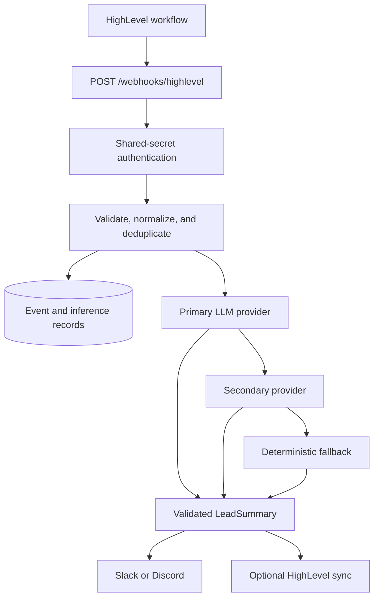

# Architecture

## Component responsibilities

- **FastAPI routes** authenticate, validate, and acknowledge HighLevel-style webhooks.
- **Lead normalizer** converts sparse inbound contact data into a stable domain model.
- **Event repository** stores raw and normalized payloads and enforces idempotency keys.
- **Summarizer** selects a configured LLM provider and uses a deterministic fallback when all providers fail.
- **Notifier** formats operational lead handoffs for Slack or Discord.
- **HighLevel sync** is an optional, isolated contact-note, tag, and custom-field integration.

## Request lifecycle

1. The route validates `X-Webhook-Secret` with a constant-time comparison.
2. Pydantic validates the incoming contact payload. Email and phone remain optional.
3. The service normalizes whitespace and derives an external id when one is absent.
4. It checks the supplied/derived id and canonical payload hash for duplicates.
5. A new event is persisted as `received`, then moved to `processing`.
6. A structured summary is generated, with provider attempts recorded as inference records.
7. The service sends a notification and optionally updates the HighLevel contact.
8. The event becomes `completed` or `partially_completed`; a duplicate receives a successful duplicate acknowledgement.

Authenticated operators can inspect an event at `GET /admin/events/{event_id}` and replay it at `POST /admin/events/{event_id}/replay`. Replays use the original normalized payload, are capped by `MAX_EVENT_REPLAY_ATTEMPTS`, and create a dead-letter record when recovery attempts are exhausted.

## Data model

`EventRecord` stores the event id, type, contact id, payload hash, raw and normalized data, timestamps, status, attempts, and any final error message.

`InferenceRecord` stores the provider, model, token counts, configured-rate estimated cost, latency, success state, fallback state, and provider error when available.

## Provider interface and error handling

Every LLM adapter implements the same `summarize(lead)` contract and returns a Pydantic-validated `LeadSummary`. OpenAI, Ollama, and OpenAI-compatible implementations retry only temporary HTTP (`429`, `502`, `503`, `504`) and network failures with exponential jitter. Invalid credentials, invalid responses, and schema errors do not retry.

The summarizer attempts a configured secondary provider after a primary failure. If no provider succeeds, it emits a deterministic summary from known lead fields, so business follow-up remains possible.

## Security boundaries

Webhook payloads are not trusted as configuration. Secrets, API tokens, and outbound URLs are environment settings. Authorization headers and full payloads are not included in notification messages. Use HTTPS and a reverse proxy in public environments.

## Scaling path

Version 1 processes synchronously to keep the request path straightforward. For higher event volumes, move `EventProcessor` work to a durable queue such as Celery, Dramatiq, RQ, or Arq. The persisted event status and idempotency keys support that transition without changing the webhook contract.

## Hosted and local deployment patterns

Run the API service on a modest CPU host and point it to a hosted LLM API for the simplest operational model. For Ollama or another local model server, run inference separately—typically on a GPU-capable host—and configure `OLLAMA_BASE_URL` or `LLM_BASE_URL` from the API service.
